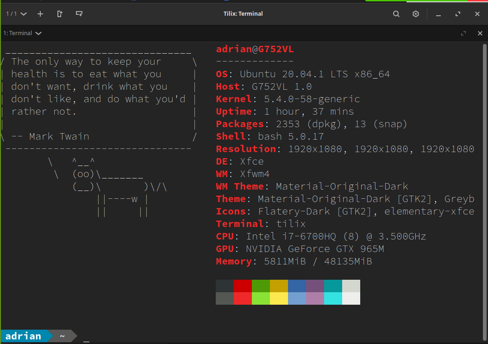

# How To install Raspberry Pi OS
Consectetur nulla enim amet laborum occaecat commodo. Ex aute incididunt sint ad officia est ullamco sint nulla. Et ex sit dolor sunt quis sint. Fugiat fugiat nisi nostrud magna duis veniam esse eu eu. Non excepteur ea dolor culpa dolor mollit id eiusmod fugiat.
## Raspberry PI OS
Consectetur fugiat ea in tempor sunt magna cillum cillum. Eu ut sunt adipisicing nostrud ex. Veniam labore sint proident cillum commodo enim dolor aliqua veniam. Cupidatat dolor et tempor ea cupidatat ipsum amet minim do laborum nostrud.
### Debian
* item 1
* item 2
* item 3
* item 4
  * item 1
  * item 2

1. one
2. two 
3. three 
   1. one
   2. two

this is **bold**
this is *italics*
This command will install apache webserver: `sudo apt install apache2 -y` 

This is hello world in bash:
` #!/bin/bash; echo "hello world"`

This is a terminal
